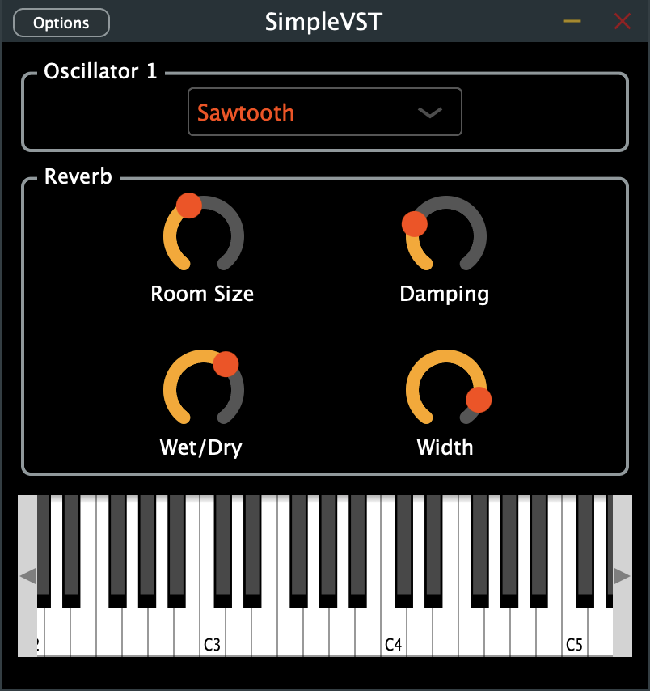

# SimpleVST Plugin

## Overview
This is a simple synthesizer VST plugin built using JUCE. It includes a basic waveform generation (sine, triangle, sawtooth), a reverb effect and a piano keyboard. More oscillators, effects and controls could be added in the future.

## Features
- Oscillator with sine, triangle and sawtooth waveforms.
- Reverb effect with adjustable room size, damping, wet/dry mix, and width.
- MIDI keyboard integration for triggering sounds.

## Screenshots
<figure>
      
</figure>

## Requirements
- [JUCE Framework](https://juce.com/get-juce) 
From MacOS terminal:
    - git clone https://github.com/juce-framework/JUCE.git
    - in JUCE/extras/Projucer/Builds/MacOSX open _Projucer.xcodeproj_
    - Build and run it
    - From the _New Project_ wizard, in _GlobalPaths_ set _Path to JUCE_ and _JUCE Modules_ to the right path
From Windows PowerShell/prompt:
    - git clone https://github.com/juce-framework/JUCE.git
    - in JUCE/extras/Projucer/Builds/VisualStudio2022 open _Projucer.sln_
    - Build and run it
    - From the _New Project_ wizard, in _GlobalPaths_ set _Path to JUCE_ and _JUCE Modules_ to the right path
- Xcode (for macOS)
- Visual Studio (for Windows)

## Building the Plugin

### MacOS (with Xcode)
1. Clone the repository:
    - git clone https://github.com/LudoLozza/SimpleVST.git 
    - cd SimpleVST
2. Open the project:
    - Open _SimpleVST.jucer_
3. Configure Xcode:
    - In Projucer, set _Selected exporter_ to Xcode (MacOS)
    - Open it on Xcode by clicking on the icon button
4. Compile the plugin:
    - In Xcode, select _Simple VST - Standalone_ plugin and run the project
  
### Windows (with Visual Studio 2022)
1. Clone the repository:
    - git clone https://github.com/LudoLozza/SimpleVST.git 
    - cd SimpleVST
2. Open the project:
    - Open _SimpleVST.jucer_ with Projucer
3. Configure Visual Studio:
    - In Projucer, set _Selected exporter_ to Visual Studio 2022
    - Open it on Visual Studio by clicking the icon button
4. Compile the plugin:
    - In Visual Studio, select _Simple VST - Standalone_ plugin and run the project
    
## Contributing
### To contribute to my project:
1. Click the _Fork_ button at the top-right corner to create your own copy of the repository
2. From the terminal:
    - git clone https://github.com/LudoLozza/SimpleVST.git
    - cd SimpleVST
3. Create your branch:
    - git checkout -b my-branch
4. Make your changes:
    - Add new features or fix bugs in the code, make sure they are well-documented
5. Commit:
    - git add .
    - git commit -m "Commit message"
6. Push:
    - git push origin my-branch
7. Submit Pull Request:
    - Go to your fork on GitHub and click the _New Pull Request_ button, clearly describing the changes you’ve made.
    
    
    
